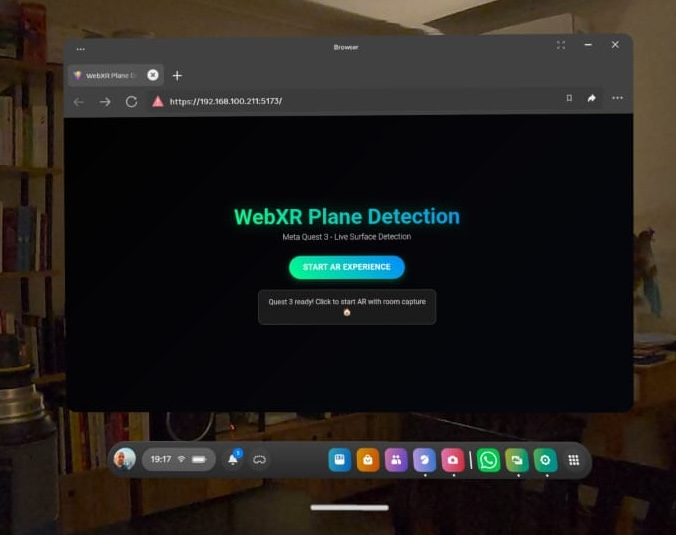
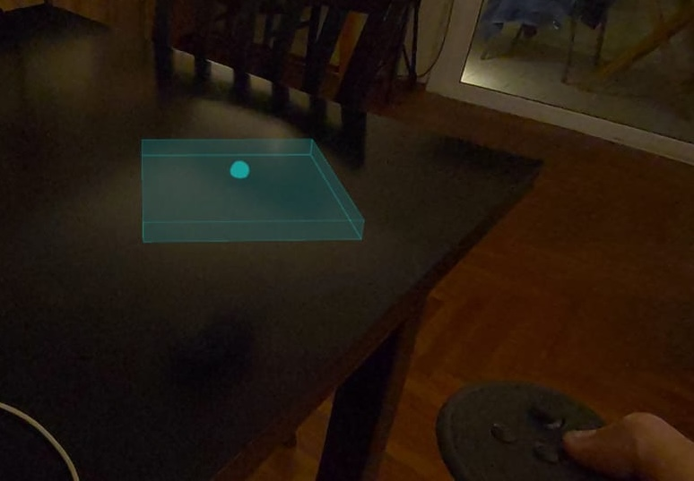
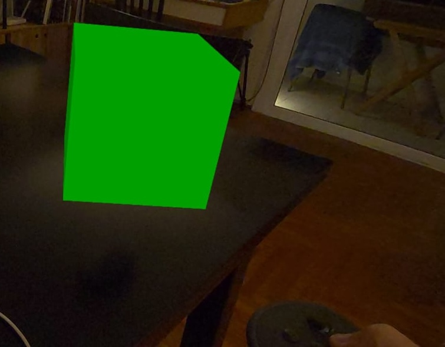

# WebXR Vanilla Plane Detection with Advanced 3D Scene System

A production-ready vanilla JavaScript WebXR application featuring advanced plane detection, hit-testing, visual cursor system, and interactive 3D tree scene placement for Meta Quest 3 headsets. This project demonstrates state-of-the-art WebXR development practices with professional 3D asset management and clean, maintainable code.

## 🚨 **HTTPS Required for WebXR**

**⚠️ CRITICAL**: WebXR APIs require HTTPS for security reasons. This application **will not work** over HTTP!

### **Development Options:**
1. **Local HTTPS Development** (Recommended)
2. **Chrome WebXR Device API Emulator** for browser testing
3. **Network HTTPS** for Quest 3 testing

See [Quick Start](#-quick-start) for detailed setup instructions.

## 📸 **Visual Showcase**

Experience the complete WebXR workflow from browser to immersive AR placement:

### **1. Browser Interface**


*Clean, modern interface with prominent "Start AR Experience" button and WebXR status indicators.*

### **2. Interactive Placement**


*Real-time cursor system showing exact placement location with surface highlighting and visual feedback for 3D tree scene.*

### **3. Positioned Object**


*Tree scene successfully placed on detected surface with repositioning capability for enhanced user experience.*

## 🚀 **Live Features**

- **🎯 Precision Hit-Testing**: WebXR hit-test API with fallback to plane detection
- **👆 Interactive Cursor System**: Real-time visual feedback with object footprint indicators  
- **🔄 3D Scene Repositioning**: Point-and-select to move placed tree scenes
- **🎨 Surface Highlighting**: Dynamic plane visualization during targeting
- **🌲 Professional 3D Assets**: GLB model loading with high-resolution textures
- **⚡ Performance Optimized**: Efficient memory management and resource cleanup
- **🛡️ Production Ready**: Complete error handling and WebXR specification compliance

## ✨ **Advanced Capabilities**

| Feature | Implementation | Status |
|---------|---------------|--------|
| **WebXR Hit-Testing** | Official W3C specification | ✅ Production |
| **Visual Cursor System** | Three.js raycasting with pulsing animation | ✅ Production |
| **Plane Visualization** | Real-time surface highlighting | ✅ Production |
| **3D Scene Management** | GLTFLoader with professional asset pipeline | ✅ Production |
| **Tree Scene Repositioning** | Ray-based object interaction | ✅ Production |
| **Memory Management** | Complete resource disposal | ✅ Production |
| **Quest 3 Optimization** | Native room capture integration | ✅ Production |

## 🎮 **User Experience**

### **Initial Placement**
1. **Start AR** → Point at surface → **Visual cursor appears**
2. **Hand pinch or controller trigger** → **Tree scene places with animation**
3. **Success feedback** with repositioning hint

### **Repositioning**
1. **Point directly at placed tree scene** → **Ray intersection detection**
2. **Select scene** → **Enters repositioning mode** (scene becomes semi-transparent)
3. **Point at new surface** → **Cursor and highlighting reappear**
4. **Select new location** → **Tree scene moves with smooth transition**

## 🛠️ **Technology Stack**

| Component | Technology | Purpose |
|-----------|------------|---------|
| **Core AR** | WebXR Device API | Session management & tracking |
| **Hit-Testing** | WebXR Hit Test Module | Precise surface targeting |
| **3D Graphics** | Three.js | Rendering & 3D math |
| **3D Assets** | GLTFLoader | Professional model loading |
| **Textures** | High-resolution PNGs | Realistic material rendering |
| **Build Tool** | Vite | Fast development & optimized builds |
| **Language** | ES6+ Vanilla JavaScript | Modern, framework-free implementation |

## 📁 **Enhanced Project Structure**

```
/
├── index.html              # WebXR entry point
├── src/
│   ├── main.js            # Core application with state management
│   ├── interaction/       # 🆕 Advanced interaction systems
│   │   ├── HitTestManager.js    # WebXR hit-testing implementation
│   │   ├── CursorManager.js     # Visual cursor system
│   │   └── PlaneVisualizer.js   # Surface highlighting
│   ├── webxr/            # WebXR foundation
│   │   ├── session.js     # Session lifecycle management
│   │   ├── renderer.js    # Three.js WebXR integration (Quest 3 optimized)
│   │   └── planes.js      # Plane detection algorithms
│   ├── utils/            # Utilities
│   │   ├── math.js        # 3D math & transformations
│   │   └── helpers.js     # General utilities
│   └── style.css         # Modern AR interface
├── assets/               # 🆕 Professional 3D assets
│   ├── tree-scene/       # Tree scene assets (59MB)
│   │   ├── treeScene.glb     # Main 3D model (39KB)
│   │   ├── groundMat_diffuse.png # Ground texture (22MB)
│   │   ├── treeMat_diffuse.png   # Tree texture (21MB)
│   │   ├── snowMat_diffuse.png   # Snow texture (14MB)
│   │   └── optimized/        # Compressed texture variants
│   └── fonts/            # Font assets for UI
├── dist/                 # 🆕 Production build output
├── .gitignore           # 🆕 Comprehensive exclusions
└── package.json         # Dependencies & scripts
```

## 🚀 **Quick Start**

### **Prerequisites**
- **Node.js 16+** for development
- **HTTPS-capable environment** (required for WebXR)
- **Meta Quest 3** (primary target) OR **Chrome with WebXR emulator**

### **🔧 Development Setup**

**Option 1: Local HTTPS Development (Recommended)**
```bash
# Clone and setup
git clone <repository-url>
cd webxr-vanilla-plain-detection
npm install

# Start with HTTPS (required for WebXR)
npm run dev
# ✅ Automatically serves on https://localhost:5173
```

**Option 2: Chrome WebXR Emulator Testing**
```bash
# 1. Install Chrome extension
# Visit: https://chrome.google.com/webstore/detail/webxr-api-emulator
# Add "WebXR API Emulator" to Chrome

# 2. Start development server
npm run dev

# 3. Open https://localhost:5173 in Chrome
# 4. Enable WebXR emulator in DevTools
# 5. Select device: "Quest 3" or "Generic Hand Tracking"
```

**Option 3: Network HTTPS for Quest 3**
```bash
# Start server accessible on network
npm run dev -- --host

# Access from Quest 3:
# Navigate to https://your-computer-ip:5173 in Meta Browser
```

### **🥽 Quest 3 Setup**
1. **Connect Quest 3** to same WiFi network as development machine
2. **Open Meta Browser** on Quest 3
3. **Navigate to** `https://your-computer-ip:5173`
4. **Grant permissions** when prompted:
   - Camera access for passthrough
   - Motion sensors for tracking
   - Spatial permissions for plane detection

### **🧪 Chrome WebXR Emulator Setup**

For browser-based development and testing:

1. **Install Extension**: [WebXR API Emulator](https://chrome.google.com/webstore/detail/webxr-api-emulator/mjddjgeghkdijejnciaefnkjmkafnnje)

2. **Enable in DevTools**:
   ```
   F12 → WebXR Tab → Enable → Select Device
   ```

3. **Available Emulated Devices**:
   - **Quest 3**: Hand tracking + controllers
   - **Quest 2**: Controller-based interaction
   - **Generic Headset**: Basic 6DOF tracking
   - **Phone AR**: Mobile AR simulation

4. **Testing Features**:
   - ✅ Hand tracking simulation
   - ✅ Controller input emulation  
   - ✅ Head movement tracking
   - ✅ Basic plane detection simulation
   - ⚠️ Limited hit-testing support

## 🔧 **Advanced Implementation Details**

### **Multi-State Placement System**
```javascript
// Enhanced state management
this.placementState = 'scanning' | 'targeting' | 'preview' | 'placed' | 'repositioning'

// Scene organization
this.sceneGroups = {
  cursors: THREE.Group(),      // Visual cursors
  planeVisuals: THREE.Group(), // Surface highlights  
  content: THREE.Group()       // Placed objects
}
```

### **WebXR Hit-Testing Integration**
```javascript
// Compliant with W3C WebXR Hit Test Module
const session = await navigator.xr.requestSession('immersive-ar', {
  requiredFeatures: ['local'],
  optionalFeatures: ['plane-detection', 'hit-test', 'anchors']
});

// Entity type configuration per specification
const hitTestSource = await session.requestHitTestSource({
  space: inputSource.targetRaySpace,
  entityTypes: ['plane', 'point'] // Comprehensive surface coverage
});
```

### **Ray-Based Scene Interaction**
```javascript
// Proper Three.js raycasting for object selection
const raycaster = new THREE.Raycaster(rayOrigin, forwardDirection);
const intersections = raycaster.intersectObject(this.treeScene, true);

if (intersections.length > 0) {
  // Accurate point-at-object detection
  this.startRepositioning();
}
```

### **Professional 3D Asset Loading**
```javascript
// GLTFLoader integration with robust error handling
const gltfLoader = new GLTFLoader();
const gltf = await gltfLoader.loadAsync('assets/tree-scene/treeScene.glb');

// Sophisticated mesh extraction
this.groundMesh = this.extractMesh(gltf.scene, 'ground_high');
this.treeMesh = this.extractMesh(gltf.scene, 'tree_low');

// High-resolution texture loading with optimization
await this.setupBasicMaterials();
```

## 🎯 **Core Systems**

### **1. HitTestManager** (`src/interaction/HitTestManager.js`)
- **WebXR specification compliant** hit-test source management
- **Entity type filtering** (planes, points, meshes)
- **Automatic cleanup** and memory management
- **Robust error handling** for session state changes

### **2. CursorManager** (`src/interaction/CursorManager.js`)  
- **Real-time visual feedback** with scene footprint design
- **Pulsing animation** synchronized with XR frame timing
- **Multi-input support** (hands and controllers)
- **Automatic cursor cleanup** for removed input sources

### **3. PlaneVisualizer** (`src/interaction/PlaneVisualizer.js`)
- **Dynamic surface highlighting** based on hit-test results
- **Efficient geometry management** with proper disposal
- **Wireframe + fill rendering** for clear surface indication
- **Performance optimized** updates only when targeting

### **4. Advanced 3D Scene Management** (`src/main.js`)
- **GLTFLoader integration** with sophisticated mesh extraction
- **Professional asset pipeline** with texture optimization
- **Multi-state placement system** with repositioning support
- **Input source tracking** with metadata
- **Race condition prevention** for async operations
- **Complete resource disposal** on session end

### **5. Quest 3 Performance Optimization** (`src/webxr/renderer.js`)
- **Optimized WebGL context** for low-latency rendering
- **Disabled antialiasing** for better frame rates
- **High-performance GPU preference** when available
- **Memory-efficient context attributes**

## 🧪 **Testing & Validation**

### **🖥️ Browser Testing (Chrome WebXR Emulator)**
```bash
# Start development
npm run dev

# Open in Chrome with emulator
# 1. Navigate to https://localhost:5173
# 2. F12 → WebXR Tab → Enable
# 3. Select "Quest 3" device
# 4. Test interactions with mouse/keyboard
```

**Emulator Capabilities:**
- ✅ **UI and 3D rendering** testing
- ✅ **State management** validation  
- ✅ **Error handling** verification
- ✅ **Basic interaction** simulation
- ⚠️ **Limited real plane detection** (simulated planes)
- ❌ **No real hand tracking** (mouse simulation)

### **🥽 Quest 3 Hardware Testing**
```bash
# Network HTTPS deployment
npm run dev -- --host
# Access: https://[your-ip]:5173

# Production build testing
npm run build
npm run preview -- --host
# Access: https://[your-ip]:4173
```

**Hardware Validation:**
- ✅ **Real plane detection** in various environments
- ✅ **Hand tracking accuracy** testing
- ✅ **Performance benchmarking** (60fps target)
- ✅ **Memory usage** monitoring
- ✅ **User experience** validation

### **WebXR Specification Compliance**
- ✅ **W3C WebXR Hit Test Module** conformance
- ✅ **Entity types configuration** per specification  
- ✅ **Proper resource disposal** following WebXR lifecycle
- ✅ **Error handling** for all WebXR state transitions

### **Performance Benchmarks**
- ✅ **60fps sustained** on Meta Quest 3
- ✅ **Memory leak free** operation
- ✅ **Efficient hit-test updates** (only when needed)
- ✅ **Optimized geometry management**

## 🔍 **Debug & Monitoring**

### **Comprehensive Logging System**
- **🎯 Hit-test events** with performance metrics
- **🎨 Cursor updates** with input source tracking  
- **🎭 Plane highlighting** with entity information
- **📊 Frame statistics** with FPS monitoring
- **⚡ Memory management** events

### **Debug Console Commands**
```javascript
// Monitor hit-test performance
this.hitTestManager.getDebugInfo()

// Track cursor system status  
this.cursorManager.getDebugInfo()

// Analyze plane detection
console.log(`Planes: ${this.availablePlanes.length}`)
```

## 🐛 **Troubleshooting**

| Issue | Solution | Chrome Emulator | Quest 3 Specific |
|-------|----------|-----------------|------------------|
| **"WebXR not supported"** | Check HTTPS + browser support | Install WebXR API Emulator | Use Meta Browser |
| **No hit-test results** | Check entity types configuration | Limited emulator support | Ensure room capture completed |
| **Cursor not appearing** | Verify input source tracking | Check mouse simulation | Check hand tracking enabled |
| **Poor plane detection** | Improve lighting conditions | Use simulated planes | Complete room scan fully |
| **Memory leaks** | Verify disposal chain working | Monitor browser memory tab | Monitor browser memory tab |
| **HTTPS certificate errors** | Accept self-signed certificate | N/A - uses localhost | Trust certificate in Meta Browser |

### **🔧 Common HTTPS Issues**

**Problem**: "This site can't be reached" or certificate warnings
```bash
# Solution 1: Accept self-signed certificate
# Navigate to https://localhost:5173
# Click "Advanced" → "Proceed to localhost (unsafe)"

# Solution 2: Use IP address instead
# Find your IP: ipconfig (Windows) or ifconfig (Mac/Linux)
# Navigate to https://your-ip:5173
```

**Problem**: Quest 3 won't connect to development server
```bash
# Solution: Ensure firewall allows Vite
# Windows: Add Vite exception to Windows Firewall
# Mac: System Preferences → Security → Firewall → Options
# Linux: Configure iptables to allow port 5173
```

**Problem**: Large 3D assets loading slowly
```bash
# Solution: Use optimized asset variants
# Development: Use compressed textures in assets/tree-scene/optimized/
# Production: Implement progressive loading for better UX
```

## 🚀 **Deployment**

### **Production Checklist**
- ✅ **HTTPS certificate configured** (required for WebXR)
- ✅ **Build optimization completed** (`npm run build`)
- ✅ **3D assets optimized** for mobile VR
- ✅ **Quest 3 hardware testing passed**
- ✅ **WebXR permissions flow tested**
- ✅ **Error handling validated**
- ✅ **Chrome emulator testing completed**

### **Performance Optimization**
- **Tree-shaking** enabled via Vite
- **Code splitting** for Three.js modules
- **Asset optimization** for mobile VR (59MB → optimized variants)
- **GLTFLoader caching** for faster subsequent loads
- **Memory management** with proper disposal

### **Production Deployment**
```bash
# Build for production
npm run build

# Preview production build locally
npm run preview -- --host

# Deploy to HTTPS hosting service
# Examples: Vercel, Netlify, GitHub Pages (with HTTPS)
```

## 📚 **WebXR Implementation Reference**

### **Specification Compliance**
- [WebXR Device API](https://www.w3.org/TR/webxr/) - Core functionality
- [WebXR Hit Test Module](https://www.w3.org/TR/webxr-hit-test-1/) - Surface targeting
- [WebXR Plane Detection](https://github.com/immersive-web/plane-detection) - Surface detection

### **Development Resources**
- [WebXR API Emulator](https://chrome.google.com/webstore/detail/webxr-api-emulator/mjddjgeghkdijejnciaefnkjmkafnnje) - Chrome extension for testing
- [Three.js WebXR Guide](https://threejs.org/docs/#manual/en/introduction/How-to-use-WebXR)
- [Meta Quest Developer Hub](https://developer.oculus.com/documentation/web/)
- [WebXR Samples](https://immersive-web.github.io/webxr-samples/)

## 🎖️ **Production Features**

This implementation includes enterprise-grade features:

- **🛡️ WebXR Specification Compliance**: Full adherence to W3C standards
- **⚡ Performance Optimized**: 60fps on mobile VR hardware  
- **🧠 Memory Management**: Zero-leak resource handling
- **🔧 Modular Architecture**: Clean, maintainable code structure
- **📊 Production Monitoring**: Comprehensive debugging and analytics
- **🎯 User Experience**: Intuitive interaction patterns
- **🌲 Professional 3D Assets**: High-quality GLB models with textures
- **🎨 Asset Pipeline**: Complete loading, optimization, and disposal

## 🤝 **Contributing**

1. Fork repository and create feature branch
2. Follow existing code style and WebXR patterns  
3. **Test in both Chrome emulator AND Quest 3 hardware**
4. Ensure WebXR specification compliance
5. Add comprehensive error handling
6. Submit pull request with detailed description

### **Development Workflow**
1. **Chrome Emulator**: Rapid iteration and UI testing
2. **Quest 3 Hardware**: Real-world validation and performance testing
3. **HTTPS Development**: Always use HTTPS for WebXR feature access

---

**Built for the WebXR future** 🚀 | **Production-ready** ✨ | **Quest 3 optimized** 🥽 | **Professional 3D Assets** 🌲 